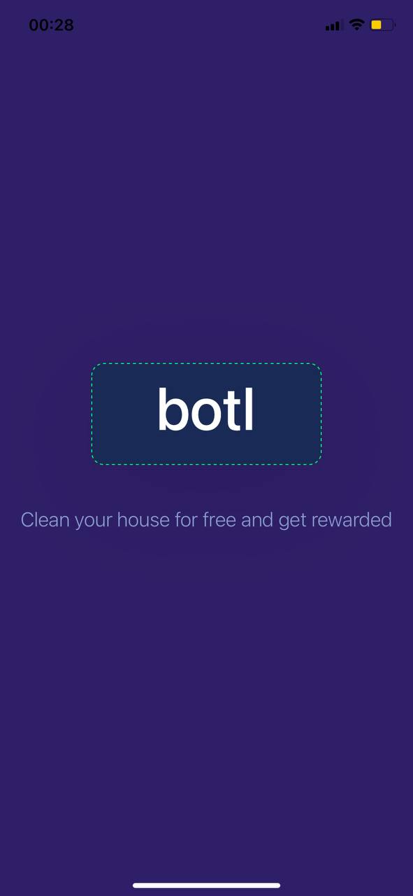
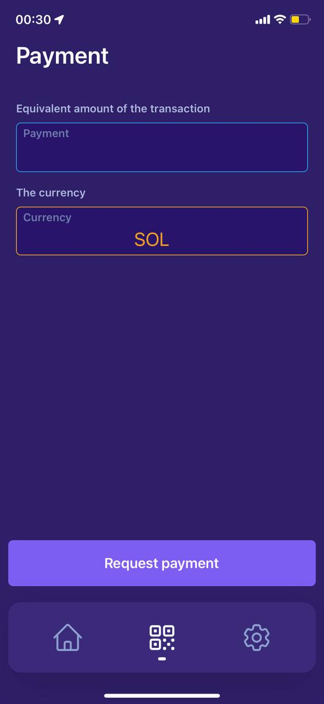
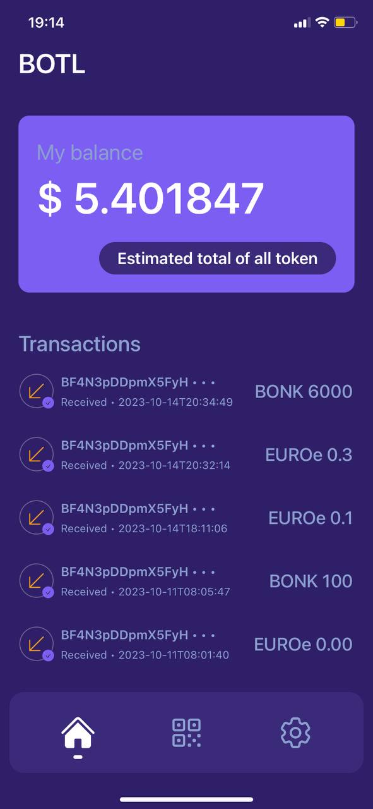

# BTOL

# Usage of the mobile app
clone the repo first, then:
```bash
cd botl
yarn
npx expo start # --tunnel if you want to test on your phone
```
Scan the QR code on your terminal
<p align="center">
    
</p>
<p align="center">
    
</p>
<p align="center">
    
</p>
